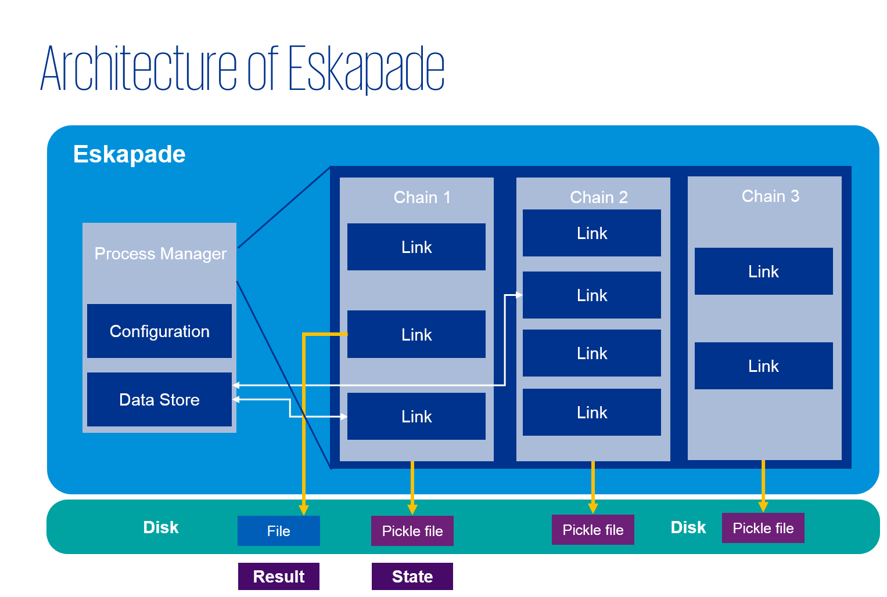

=================
Package structure
=================

Eskapade contains many tools, and to find and use them most efficiently it is necessary to understand how the
repository is build up. This section discusses the structure of the code and how the framework handles subpackages.

Architecture
------------

The architecture of Eskapade can be summarized in this picture:

The example we just discussed generally shows how the framework works.
The steps it takes are the following:

  - eskapade_run runs the macro file,
  - Macros (python file) contain Chains,
  - Chains (python object) contains Links,
  - Links (python class) contain analysis code.

The chains are run in the order of 'registering' them in the ``ProcessManager``.

The ``ProcessManager`` is the ultimate object that executes all the code in your macro.
It also keeps track of the configuration of Eskapade, and of the objects in the ``data store`` that are passable between links.

The components of the architecture of Eskapade are explained in further detail in the `Tutorials section <tutorials.html>`_.

Structure
---------

When using Eskapade it is important to understand where all components are located. The components can be for
example links or utilities that you want to use.

The Eskapade framework is contained in the Python package ``eskapade``,
which lives in the ``python`` directory.  Every specific subject has its
subpackage in ``eskapade``, containing the utilities it needs, the links
that are defined for the subject.

The core of the framework is implemented in the ``core`` subpackage.
This subpackage contains the low-level machinery for running analysis
algorithms in chains of links.  The ``core_ops`` subpackage contains
basic links for operating this framework.

An example of a typical subpackage is ``eskapade.analysis``, which
contains basic analysis tools.  Its structure is common to all Eskapade
subpackages::

   |-eskapade
      |-analysis
         |-links

The subpackage contains several modules, which contain classes and
functions to be applied in links.  The ``eskapade.analysis.statistics``
module, for example, contains code to generate an overview of the
statistical properties of variables in given input data.

Eskapade links are located in the ``links`` directory.  There is a
separate module for each link, defining the link class instance.  By
convention, the names of the module and class are both the link name,
the former in snake case and the latter in camel case.  For example, the
module ``read_to_df`` defines the link class ``ReadToDf``.

The tests are contained separately in the Python package ``eskapade_python``
under ``tests`` directory. Ideally, there is a test module
for each (link) module in the Eskapade package.  Optionally, integration tests
are implemented in ``integration``. For the ``eskapade.analysis`` package, there is
the module ``test_tutorial_macros`` with integration tests that run the
tutorial macros corresponding to this subpackage::

   |-eskapade_python
      |-analysis
         |-integration
            |-test_tutorial_macros.py

Subpackages
-----------

Eskapade contains the following list of subpackages:

* ``core`` is the package that contains the core framework of Eskapade.
* ``core_ops`` contains links pertaining to the core functionality of Eskapade.
* ``analysis`` contains pandas links and code.
* ``visualization`` contains visualization code and plotter links.
* ``data_quality`` contains links and code for fixing messy data.

Imports
-------

Main elements of the Eskapade framework are imported directly from the
``eskapade`` package.  For example, the run-configuration object and the
run-process manager are part of the core subpackage, but are imported by

.. code-block:: python

  from eskapade import process_manager, ConfigObject

Links are imported directly from their subpackage:

.. code-block:: python

  from eskapade.analysis import ReadToDf

In a macro, you can now instantiate and configure the ``ReadToDf`` link
and add it to a chain in the process manager.

Results
-------

Results of a macro are written out by default in the ``results``
directory. The analysis run is persisted in the results directory by the
``analysis_name`` given in the macro. This directory has the following
structure:

  * ``config``: the configuration macro
  * ``proc_service_data``: persisted states of run-process services
  * ``data``: analysis results, such as graphs or a trained model

The data for each of these elements are stored by the analysis version,
e.g. ``v0``, ``v1``, ``v2``, etc.  For example, the report produced by
the tutorial ``esk301_dfsummary_plotter`` is saved in the directory
``results/esk301_dfsummary_plotter/data/v0/report``.

Debugging
---------

When building new Links or other functionality you will want to debug at some point. There are multiple ways to do
this, because there are multiple ways of running the framework. A few ways are:

  * Running in the terminal. In this scenario you have to work in a virtual environment (or adjust your own until it
    has all dependencies) and debug using the terminal output.
  * Running in a notebook. This way the code is run in a notebook and you can gather the output from the browser.
  * Running in a docker. The code is run in the docker and the repository is mounted into the container. The docker
    (terminal) returns output.
  * Running in a VM. In this case you run the code in the VM and mount the code into the VM. The output can be
    gathered in the VM and processed in the VM.

In the first three options you want to use an IDE or text-editor in a 'normal' environment to debug your code and in
the last option you can use an editor in the VM or outside of it.

Troubleshooting
---------------

The least error prone ways are docker and VMs, because they automatically have the dependencies set.
