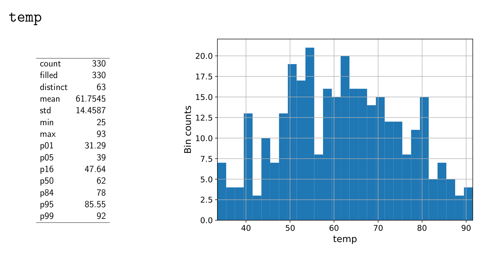

========
Tutorial
========

This section contains materials on how to use Eskapade. There are additional side notes on how certain
aspects work and where to find parts of the code. For more in depth explanations on the functionality of the code-base,
try the `API-docs <eskapade_index.html>`_.

Running your first macro
------------------------

After successfully `installing <installation.html>`_ Eskapade, it is now time to run your very first
macro, the classic code example: Hello World!

Hello World!
~~~~~~~~~~~~

If you just want to run it plain and simple, go to the root of the repository and run the following:

.. code-block:: bash

  $ source setup.sh
  $ run_eskapade.py ./tutorials/esk101_helloworld.py

This will run the macro that prints out Hello World. There is a lot of output, but try to find back these
lines (or similar):

.. code-block:: python

   2017-02-27 20:32:19,826 INFO [hello_world/execute]: Hello World
   2017-02-27 20:32:19,828 INFO [hello_world/execute]: Hello World

Congratulations, you have just successfully run Eskapade!

Internal workings
~~~~~~~~~~~~~~~~~

To see what is actually happening under the hood, go ahead and open up ``/tutorials/esk101_helloworld.py``.
The macro is like a recipe and it contains all of your analysis. It has all the 'high level' operations that are to be
executed by Eskapade.

When we go into this macro we find the following piece of code:

.. code-block:: python

  link = core_ops.HelloWorld(name='HelloWorld')
  link.set_log_level(logging.DEBUG)
  link.repeat = settings['n_repeat']
  ch.add_link(link)

Which is the code that does the actual analysis (in this case, print out the statement). In this case ``link`` is an
instance of the class HelloWorld, which itself is a Link. The Link class is the fundamental building block in Eskapade that
contains our analysis steps. The code for HelloWorld can be found at:

.. code-block:: bash

  $ less $ESKAPADE/python/eskapade/core_ops/links/hello_world.py

Looking into this class in particular, in the code we find in the ``execute()`` function:

.. code-block:: python

  self.log().info('Hello {0}'.format(self.hello))

where ``self.hello`` is a parameter set in the ``__init__`` of the class. This setting can be overwritten as can be seen
below. For example, we can make another link, ``link2`` and change the default ``self.hello`` into something else.

.. code-block:: python

  link2 = core_ops.HelloWorld(name='Hello2')
  link2.hello = 'Lionel Richie'
  ch.add_link(hello2)

Rerunning results in us greeting the famous singer/songwriter.

This is generally how the framework works. The steps it takes are the following:
  - run_eskapade.py runs the macro file,
  - Macros (python file) contain Chains,
  - Chains (python object) contains Links,
  - Links (python class) contain analysis code.

And these chains are run in the order of 'registering' them in the ProcessManager. The ProcessManager is the ultimate
object that executes all the code in your macro.

There are many ways to run your macro and control the flow of your analysis. You can read more on this in
the `Short introduction to the Framework`_ subsection below.

Advanced macros
---------------

Now that we know the basics of Eskapade we can go on to a more advanced macro, containing an actual analysis.

Tutorial 1: transforming data
-----------------------------

Before we get started, we have to fetch some data, on your command line, type:

.. code-block:: bash

  $ wget -P $ESKAPADE/data/ https://statweb.stanford.edu/~tibs/ElemStatLearn/datasets/LAozone.data

To run the macro type on your CLI:

.. code-block:: bash

  $ run_eskapade.py tutorials/tutorial_1.py

If you want to add command line arguments, for example to change the output logging level, read the
`section <tutorial.html#command-line-arguments>`_ below.

When looking at the output in the terminal we read something like the following:

::

   * * * Welcome to Eskapade * * *
   ...
   2017-02-10 15:24:35,968 INFO [processManager/Print]: Number of chains:    2
   ...
   * * * Leaving Eskapade. Bye! * * *

There is a lot more output than these lines (tens or hundred of lines depending on the log level).
Eskapade has run the code from each link in the summary from top to bottom.

We can see that the macro contains two chains and a few Link are contained in these chains. Note that chain 2 is empty at
this moment. In the first chain we see that data is loaded first and then a transformation is applied to this data.

Before we are going to change the code in the macro, there will be a short introduction to the framework.

Short introduction to the Framework
~~~~~~~~~~~~~~~~~~~~~~~~~~~~~~~~~~~

At this point we will not go into the underlying structure of the code that is underneath the macro, but later in this
tutorial we will. For now we will take a look in the macro. So open ``tutorials/tutorial_1.py`` in your
favorite editor. We notice the structure: first imports, then defining all the settings, and finally the actual
analysis: Chains and Links. There are two chains added to the macro, by running the code:

.. code-block:: python

  proc_mgr.add_chain('Data')

a chain called ``Data`` is added to the ProcessManager, which is the object that runs the entire macro. Then the chain is fetched by:

.. code-block:: python

  proc_mgr.get_chain('Data')

and a Link is added. First the link is initialized (links are classes) and its properties are set, and finally it is
inserted into the chain:

.. code-block:: python

  reader = analysis.ReadToDf(name='Read_LA_ozone', path=DATA_FILE_PATH, reader=pd.read_csv, key='data')
  proc_mgr.get_chain('Data').add_link(reader)

This means the Link is added to the chain and when Eskapade runs, it will execute the code in the Link.

Now that we know how the framework runs the code on a higher level, we will continue with the macro.

In the macro notice that under the second chain some code has been commented out.
Uncomment the code and run the macro again with:

.. code-block:: bash

  $ run_eskapade.py tutorials/tutorial_1.py

And notice that it takes a bit longer to run, and the output is longer, since it now executes the Link in chain 2. This Link takes the data from chain 1
and makes plots of the data in the data set and saves it to your disk. Go to this path and open one of the pdfs found
there:

.. code-block:: bash

  $ results/Tutorial_1/data/v0/report/

The pdfs give an overview of all numerical variables in the data in histogram form. The binning, plotting and saving
of this data is all done by the chain we just uncommented. If you want to take a look at how the Link works, it can be
found in:

.. code-block:: bash

  $ python/eskapade/visualization/links/df_summary.py

But for now, we will skip the underlying functionality of the links.

Let's do an exercise. Going back to the first link, we notice that the transformations that are executed are defined in ``conv_funcs`` passed to the link.
We want to include in the plot the wind speed in km/h. There is already a
part of the code available in the ``conv_funcs`` and the functions ``comp_date`` and ``mi_to_km``. Use these functions
as examples to write a function that converts the wind speed.

Add this to the transformation by adding your own code. Once this works you can also try to add the
temperature in degrees Celsius.

Making a Link
-------------

Now we are going to add a new link that we create! To make a new link type the following:

.. code-block:: bash

  $ make_link.sh python/eskapade/analysis/links YourLink

The script will make a link object named ``YourLink`` in the path specified in the first argument.
The link we wish to add will do some textual transformation, so name it accordingly.
And be sure to follow the instructions given by the script!

The script creates the skeleton file:

.. code-block:: bash

  $ python/eskapade/analysis/links/yourlink.py

This skeleton file can be modified with your custom editor and then be imported and called inside a macro with ``analysis.YourLink()``.

Now open up the link in your editor.
In the ``execute`` function of the Link, we see that a DataStore is called. This is the central in-memory object in
which all data is saved. DataStore inherits from a dict, so by calling the right key we can get objects. Call:

.. code-block:: python

  ds = ds['data']

to get the DataFrame that includes the latest transformations.

Now we are going to make a completely different
transformation in the Link and apply it to the object in the DataStore. We want to do add a column to the data that
states how humid it is. When column 'humidity' is less than 50 it is 'dry', otherwise it is 'humid'.
You will have to use some pandas functionality or perhaps something else if you prefer. Save the
new column back into the DataFrame and then put the DataFrame in the DataStore under the key 'data_new'.

We are going to let our plot functionality loose on this DataFrame once more, to see what happens to our generated
textual data, since this can normally not be plotted!

Now run the entire macro with the new code and compile the output .tex file. This can be done on the command line with

.. code-block:: bash

  $ pdflatex $ESKAPADE/results/Tutorial_1/data/v0/report/report.tex

Now take a look at the output pdf. The final output should look something like this:

Your plot should be quite similar (though it might be different in its make up.)

In summary, the work method of Eskapade is to run chains of custom code chunks (links).
Each chain should have a specific purpose, for example pre-processing incoming data, booking and/or
training predictive algorithms, validating these predictive algorithms, evaluating the algorithms.

By using this work method, links can be easily reused in future projects. Some links are provided by default.
For example, links used to load data from a json file, book predictive algorithms, predict the training and
test data set and produce evaluation metrics. If you want to use your own predictive model just go ahead and add your own links!

Tutorial 2: macro from basic Links
----------------------------------

In this tutorial we are going to build a macro using existing Links. We start by using templates to make a new macro.
The command

.. code-block::  bash

  $ make_macro.sh tutorials/ Tutorial_2

makes a new macro from a template macro.
When we open the macro we find a lot of options that we can use. For now we will actually not use them, but if you want
to learn more about them, read the `Examples <tutorial.html#examples>`_ section below.

First we will add new chains to the macro. These are the higher level building blocks that can be controlled when
starting a run of the macro. At the bottom of the macro we find a commented out Link, the classic Hello World link.
You can uncomment it and run the macro if you like, but for now we are going to use the code to make a few chains.

So use the code and add 3 chains with different names:

.. code-block:: python

  ch = proc_mgr.add_chain('CHAINNAME')

When naming chains, remember that the output of Eskapade will print per chain-link combination the logs that are
defined in the Links. So name the chains appropriately, so when you run the macro the logging actually makes sense.

This tutorial will be quite straight-forward, it has 3 short steps, which is why we made 3 chains.

1. In the first chain: Read a data file of your choosing into Eskapade using the pandas links in the analysis
   subpackage.
2. In the second chain: Copy the DataFrame you created in the DataStore using the core_ops subpackage.
3. In the third chain: Delete the entire DataStore using a Link in the core_ops subpackage.

To find the right Links you have to go through the Eskapade code (or documentation!), and to find within it's
subpackages the proper Links you have to understand the package structure.

Every package is specific for a certain task, such as analysis, core tasks (like the ``ProcessManager``), or data
quality. Not all packages will be in the first releases, they will be added in the future. However this tutorial only uses
Links that are in the release. Every subpackage contains links in its ``links/`` subdirectory.

- The ``core`` package is just core framework functionality, the links for the core are in ``core_ops``.
- ``analysis`` contains pandas links.
- ``visualization`` contains plotter links.

(In the near future we will add spark links as well.)

The name of every link indicates its basic function. If you want to know explicitly you can read the auto-documentation.
If that does not help, read and try to understand the example macro's in ``tutorials/``, which show the basic usage
of most Eskapade functionality. (See also the `Examples <tutorial.html#examples>`_ section below.)
If still unclear, go into the link's code to find out how it exactly works.

Hopefully you now have enough knowledge to make this tutorial and finally run Eskapade by yourself.

Examples
--------

There is also a set of example macro's in the ``tutorials/`` folder. They start out with the basics and core code
of Eskapade and work their way up to more complicated ways of working. The examples are described briefly here.

Example esk101: Hello World!
~~~~~~~~~~~~~~~~~~~~~~~~~~~~

Macro 101 runs the Hello World Link. It runs the Link twice using a repeat kwarg, showing how to use kwargs in
Links.

Example esk102: Multiple chains
~~~~~~~~~~~~~~~~~~~~~~~~~~~~~~~

Macro 102 uses multiple links to print different kinds of output from one Link. This link is initialized multiple
times with different kwargs and names. There are if-statements in the macro to control the usage of the chains.

Example esk103: Print the DataStore
~~~~~~~~~~~~~~~~~~~~~~~~~~~~~~~~~~~

Macro 103 has some objects in the DataStore. The contents of the DataStore are printed in the standard output.

Example esk104: Basic DataStore operations
~~~~~~~~~~~~~~~~~~~~~~~~~~~~~~~~~~~~~~~~~~

Macro 104 adds some objects from a dictionary to the DataStore and then moves or deletes some of the items. Next it
adds more items and prints some of the objects.

Example esk105: DataStore Pickling
~~~~~~~~~~~~~~~~~~~~~~~~~~~~~~~~~~

Macro 105 has 3 versions: A, B and C. These are built on top of the basic macro esk105. Each of these 3 macro's does
something slightly different:

  -A does not store any output pickles,
  -B stores all output pickles,
  -C starts at the 3rd chain of the macro.

Using these examples one can see how the way macro's are run can be controlled and what it saves to disk.

Example esk106: Command line arguments
~~~~~~~~~~~~~~~~~~~~~~~~~~~~~~~~~~~~~~

Macro 106 shows us how command line arguments can be used to control the chains in a macro. By adding the arguments
from the message inside of the macro we can see that the chains are not run.

Example esk107: Chain loop
~~~~~~~~~~~~~~~~~~~~~~~~~~

Example 107 adds a chain to the macro and using a repeater Link it repeats the chain 10 times in a row.

Example esk108: Event loop
~~~~~~~~~~~~~~~~~~~~~~~~~~

Example 108 processes a text data set to loop through every word and do a Map and Reduce operation on the data set.
Finally a line printer prints out the result.

Example esk201: Read data
~~~~~~~~~~~~~~~~~~~~~~~~~

Macro 201 reads a files into the DataStore. The first chain reads one csv into the DataStore, the second chain reads
multiple files (actually the same file multiple times) into the DataStore. (Looping over data is shown in example esk301.)

Example esk202: Write data
~~~~~~~~~~~~~~~~~~~~~~~~~~

Macro 202 reads a DataFrame into the data store and then writes the DataFrame to csv format on the disk.

Example esk203: Apply a function
~~~~~~~~~~~~~~~~~~~~~~~~~~~~~~~~

Macro 203 creates a DataFrame and puts it in the DataStore. Next it uses the apply Link to apply some basic pandas functions to the
data in the DataStore. The original data is deleted using a Link.

Example esk204: Apply a query
~~~~~~~~~~~~~~~~~~~~~~~~~~~~~

Macro 204 creates a DataFrame and puts it in the DataStore. Next it uses the selection Link to slice the data in the
DataFrame. The original data is deleted using a Link.

Example esk205: Concatenate DataFrames
~~~~~~~~~~~~~~~~~~~~~~~~~~~~~~~~~~~~~~

Macro 205 creates some DataFrames and puts them in the DataStore. The DataFrames are concatenated into a new DataFrame
that is saved under a new key. The original data is deleted and the new DataFrame is printed out.

Example esk206: Merge DataFrames
~~~~~~~~~~~~~~~~~~~~~~~~~~~~~~~~

Macro 206 creates two DataFrames that are subsequently merged into one. The original data is deleted and the result
is printed out.

Example esk301: File loop
~~~~~~~~~~~~~~~~~~~~~~~~~

Macro 301 loops over files in different ways. The first chain loops over 3 separate files (actually the same file
multiple times), the second chain loops over the same 3 files but uses a chunk size. Then the individual results are merged into
one DataFrame using a concatenation Link. This is to show the different ways of reading data in case of multiple or
very large files.

Example esk302: Summary plot
~~~~~~~~~~~~~~~~~~~~~~~~~~~~

Macro 302 generates some data using a generator Link (in the previous macros it was hard-coded) and visualizes the
result using a plotter Link.

Command Line Arguments
----------------------

We start this section with a short overview of a few often used arguments that Eskapade has.

At the end of running the Eskapade program, by default the DataStore and configuration object are pickled and written out to:

.. code-block:: bash

  $ ls -l results/Tutorial_1/proc_service_data/v0/latest/
  
When you are working on a macro, once you are done tweaking it, you can store also the results of each chain in pickle files:

.. code-block:: bash

  $ run_eskapade.py -w tutorials/tutorial_1.py

Eskapade uses these pickle files to load the trained models and uses them to predict new samples real-time,
but also to pick up running at a later stage in the chain setup.

For example, if running Eskapade takes a long time, you can run one chain as well:

.. code-block:: bash

  $ run_eskapade.py -s Name_Chain tutorials/tutorial_1.py

This command uses as input the stored pickle files from the previous chain.
This might come in handy when, for example, data pre-processing of your training set takes a long time.
In that case, you can run the pre-processing chain over night, store the results in a pickle file and start with
the training chain the next day.

Start running Eskapade from a specified chain:

.. code-block:: bash

  $ run_eskapade.py -b Name_Chain tutorials/tutorial_1.py

Stop running after a specified chain:

.. code-block:: bash

  $ run_eskapade.py -e Name_Chain tutorials/tutorial_1.py

Below we explain the most important command-line arguments in detail.

Set log level
~~~~~~~~~~~~~

The log level is controlled with the `-L` argument. To set the log level to debug level, add::

  -L DEBUG

to the command line:

.. code-block:: bash

  $ run_eskapade.py -L DEBUG tutorials/tutorial_1.py

The available log levels are::

  DEBUG,
  INFO,
  WARN,
  WARNING,
  ERROR,
  FATAL,
  CRITICAL,
  OFF

They correspond to the appropriate POSIX levels.

When writing your own Link, these levels can be accessed with the logger module:

.. code-block:: python

  self.log().debug('Text to be printed when logging at DEBUG level')

All output is done in this manner, never with the python print function, since this yields us more control over the
process.

Help
~~~~

Help can be called by running the following:

.. code-block:: bash

  $ run_eskapade.py --help

Interactive python mode
~~~~~~~~~~~~~~~~~~~~~~~

To keep the results in memory at end of session run Eskapade in interactive mode. This is controlled with
the argument ``-i``:

.. code-block:: bash

  $ run_eskapade.py -i tutorials/tutorial_1.py

At the end of the session an ``ipython`` console is started from which e.g. the data store can be accessed.
  
Saving states
~~~~~~~~~~~~~

To write out the intermediate results from each chain add the command line argument ``-w``. This will write pickles in
``results/$analysis_name/data/$version/`` containing the state of Eskapade at the end of the chain:

.. code-block:: bash

  $ run_eskapade.py -w tutorials/tutorial_1.py

To write out the state after one particular chain, use option ``-W``:
  
.. code-block:: bash

  $ run_eskapade.py -W SomeParticularChain tutorials/tutorial_1.py

To not store any pickle files, run with the option ``-n``:

.. code-block:: bash

  $ run_eskapade.py -n tutorials/tutorial_1.py
  
Single Chain
~~~~~~~~~~~~

To run a single chain add the command line argument ``-s chain_name``. By default this picks up the data stored by
the previous chain in the macro. It is therefore necessary to have run the previous chain, otherwise the engine can
not start:

.. code-block:: bash

  $ run_eskapade.py -s chain_name tutorials/tutorial_1.py

Start from a Chain
~~~~~~~~~~~~~~~~~~

To start from a chain use the command line argument ``-b chain_name``, by default this picks up the data stored by
the previous chain in the macro:

.. code-block:: bash

  $ run_eskapade.py -b chain_name tutorials/tutorial_1.py

Stop at a Chain
~~~~~~~~~~~~~~~

To end the running of the engine at a chain use the command line argument ``-e chain_name``, by default this picks
up the data stored by the previous chain in the macro:

.. code-block:: bash

  $ run_eskapade.py -e chain_name tutorials/tutorial_1.py

Changing analysis version
~~~~~~~~~~~~~~~~~~~~~~~~~

A version number is assigned to each analysis, which by default is 0. It can be upgraded by using the option ``-v``.  
When working on an analysis, it is recommended to update this number regularly for bookkeeping purposes.

.. code-block:: bash

  $ run_eskapade.py -v 1 tutorials/tutorial_1.py

Notice that the output of this analysis is now stored in the directory:

.. code-block:: bash

  $ ls -l results/Tutorial_1/data/v1/report/

Notice as well that, for bookkeeping purposes, a copy of the (evolving) configuration macro is always stored as well, under:

.. code-block:: bash

  $ ls -l results/Tutorial_1/config/v*/tutorial_1.py

Running an old configuration (macro)
~~~~~~~~~~~~~~~~~~~~~~~~~~~~~~~~~~~~

When you run an Eskapade macro, at the end of the program the settings you used for the run are saved in a config file.
In the python session you ran in, this config is kept in the object called 'configObject'.
After the sessions ends, this configObject is pickled for later use.

This allows for rerunning older versions of the code, since they are saved in the state they were in at run-time.
If you want to run an old version of the configObject named ``$analysis``, this can easily by done with the
argument ``-u``:

.. code-block:: bash

  $ run_eskapade.py -u results/Tutorial_1/proc_service_data/v0/latest/eskapade.core.process_services.ConfigObject.pkl

In this way, rolling back to a previous point is straight-forward.

For lookup purposes a copy of the configuration macro is always stored as well, under:

.. code-block:: bash

  $ ls -l results/Tutorial_1/config/v0/tutorial_1.py

Profiling your code
~~~~~~~~~~~~~~~~~~~

Your can profile the speed of your analysis functions by running the option ``-P``:

.. code-block:: bash

  $ run_eskapade.py -P tutorials/tutorial_1.py

After running this prints out a long list of all functions called, including the time it took to run each of of them.

Combining arguments
~~~~~~~~~~~~~~~~~~~

Of course you can add multiple arguments to the command line, the result would be for example an interactive session in
debug mode that writes out intermediate results from each chain:

.. code-block:: bash

  $ run_eskapade.py -i -w -L DEBUG tutorials/tutorial_1.py

Eskapade in PyCharm
-------------------

PyCharm is a very handy IDE for debugging Python source code. It can be used to run Eskapade stand-alone
(i.e. like from the command line) and with an API.

Stand-alone
  * Install PyCharm on your machine.
  * Open project and point to the Eskapade source code
  * Configuration, in 'Preferences', check the following desired values:
      - Under 'Project: eskapade' / 'Project Interpreter':
          - The correct Python version (currently 3.5.2 of Anaconda, use the interpreter of your conda environment)
      - Under 'Build, Execution & Deployment' / 'Console' / 'Python Console':
          - The correct Python version (currently 2.7.x of Anaconda, use the interpreter of your conda environment)
  * Run/Debug Configuration:
      - Under 'Python' add new configuration
      - Script: ``run_eskapade.py``
      - Script parameters: ``-w ../tutorials/tutorial_1.py``
      - Working directory: ``$ESKAPADE/scripts``
      - Python interpreter: check if it is the correct Python version (currently 3.5.2 of Anaconda, corresponding to
        your conda environment)
      - Environment variables: should contain those in ``source.sh``

You should now be able to press the 'play button' to run Eskapade with the specified parameters.

