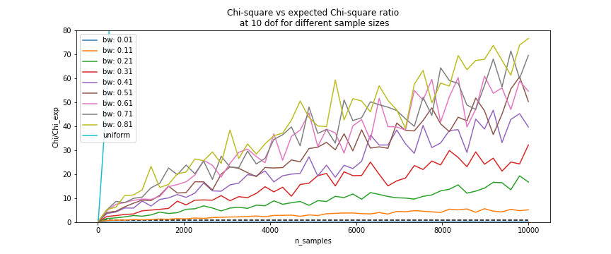

Tutorial 5: Data Mimic
----------------------------

This section contains materials on how to use Eskapade in to re-simulate data. We will explain how to use the links present in the submodule and what choice were made. 

Running the macro
~~~~~~~~~~~~~~~~~

To run the tutorial macro enter the command in a shell:

.. code-block:: bash
  
  $ eskapade_run $TUTDIR/esk701_mimic_data.py

The tutorial macro illustrates how to resample a dataset using kernel density estimation (KDE). The macro can handle contiunous data, and both ordered and unordered catagorical data. 
The macro is build up in the following way:

* A dataset is simulated containing mixed data types, representing general input data.
* Some cleaning steps are performed on the dataset
* KDE is applied to the dataset
* Using the estimated bandwidths of the KDE, the data is resampled
* An evaluation is done on the resulting resimulated dataset

We'll go through each of the links and explain the workings, choices made and available options so to help facitilitate the use after a client engagement.

To run the macro for a client engamgent you need to change out the first link, which simulates fake data, to the ReadToDf link in order to read in the data:

.. code-block:: python
    
    settings['input_path'] = 'diamonds.csv'
    settings['reader'] = 'csv'
    settings['separator'] = ','
    settings['maps'] = maps

    np.random.seed(42)

    ch = Chain('do_all')

    reader = analysis.ReadToDf(name='reader',
                               path=settings['input_path'],
                               sep=settings['separator'],
                               key='df',
                               reader=settings['reader'])
    ch.add(reader)

For ordered variables that are strings, it is important that you provide the ``settings['maps'])`` variable. It contains a dictonary mapping the string values of the variable to a numeric value that matches the order from low to high. For example, a variable ordered containing 'low', 'medium' and 'high' values should be mapped to 0, 1 and 3. If the mapping is not included the macros will assing numeric values but in order of first appearance, thus not guaranteeing the implied order of the strings. (aka: the macro doesnt know 'low' is the lowest, or 'V1' is the lowest value in your catagory.)

.. warning::
  When providing the map for ordered catagorical variables, you also need to add them for the unordered catagorical variables which are strings. The macro will either create maps for all string variables, or will use the provided ``maps`` input.

Addionally, you need to provide the macro with the data type contained in each column, ordered-, and unordered catagorical, or continuous. Finally also provide the columns which contain strings, so the macro will transfer them to numerical values. In case of ordered catagorical values this will happen using the ``maps`` you mentioned above. If it is not provided, the macro will automatically create a map and add it to the datastore. The automatically created map does not take any implicit order of catagories into account.

.. code-block:: python

    settings['unordered_categorical_columns'] = ['a','b']
    settings['ordered_categorical_columns'] = ['d','c']
    settings['continuous_columns'] = ['e','f','g']
    settings['string_columns'] = ['a','c']

The rest of the macro can be run as is as far as functionality goes. There are a few parameters that can be tweaked to optimize the results:

 - ``ds['bw']`` in ``Resampler`` is a list of bandwidths estimated by the kde corresponding to the columns of the data as stored in ``ds``.
 - ``bins`` in ``ResampleEvaluation`` controls the bins used to bin the data for chi square evaluation. For more details on the impact of choosing these bins please refer to Chi-square_

Mixed Variables Simulation
^^^^^^^^^^^^^^^^^^^^^^^^^^

The first link exists to create some fake data to run the tutorial macro on. Naturally, if you want to run the data_mimic to resimulate a specific dataset, this link is not necessary.

The link takes some parameters as input that will determine how the data is generated, such as the number of observations, the probabilities associated with each category per dimension, and the mean stds for the coninuous data.

KDE Preperation
^^^^^^^^^^^^^^^
In order to do Kernel Density Estimation we need to prepare the data. This means:
 - Converting strings to dummy integer variables and saving the mapping
 - Remove any ``NaN`` values present
 - Find peaks in distributions
 - Transforms continuous variables to copula space (transform to a normal distribution)
 - Performs a PCA transformation (optional)
 - Hash column names and variables if required

Each of these transformations are saved to the datastore including their properties needed to transform the data back.

Kernel Density Estimation
^^^^^^^^^^^^^^^^^^^^^^^^^
This link performs the actual KDE. The link takes the normalized data in case of the continuous variables, and the data without ``NaN`` values for catagorical variables. It then applies the ``KDEMultivariate`` implementation from statsmodels, using the 'normal-rule-of-thumb' for quick calculation.

.. note::
  There is a faster method available if only unordered variables are present. This method is selected automatically.

The result is a bandwidth *bw* for each variable, which are saved in a list in the datastore.

Resampler
^^^^^^^^^

Currently the resampler loops over each datapoint and variable `j` and resamples by:
  - Resamples a new point from a normal distribution centered at the original datapoint, with ``std=bw[j]``, for continuous varibales.
  - Resamples randomly from all catagories != current catagory if ``bw[j] > np.random.rand()`` for unordered catagorical variables.
  - Resamples using a Wang-Ryzin kernel defined at the datapoint using bandwith ``bw[j]`` for ordered catagorical variables. 

ResampleEvaluation
^^^^^^^^^^^^^^^^^^
Evaluates the distribution similarities based on Chi-square, Kolmogorov-Smirnov and the Cosine distance. The formulas and applications of these metrics to the datset are explained below.

Chi-square
==========

When applying the two sample chi-square test we are testing whether two datasets come from a common distribution.

- :math:`H_0`: The two sets come from a common distribution
- :math:`H_1`: :math:`H_0` is false, the sets come from different distributions

The Chi-square test we use is calculated using the formula:

.. math::

  \chi^2 = \sum_{i=1}^{k}{\frac{(K_R * R - K_E * E)^2}{R}}

where R is the resampled dataset and E the expected values, or in our context, the original dataset.

.. math::
  K_R = \sqrt{\frac{\sum(E_i)}{\sum(R_i)}}

  K_E = \sqrt{\frac{\sum(R_i)}{\sum(E_i)}}

In case the datasets are not of equal sample size, we can still use the Chi-square test using the scaling constants. If the sets of of equal sample size, the constants will go to 1, and we are left with the 'traditional' chi-square formula:

.. math::
  \chi^2 = \sum_{i=1}^{k}{\frac{(R - E)^2}{E}}

Kolmogorov-Smirnov
==================

The Kolmogorov–Smirnov test may also be used to test whether two underlying one-dimensional probability distributions differ. In this case, we apply the KS test to each variable and save the results.

.. note::
  The KS test assumes the distribution is continuous. Although the test is run for all variables, we should keep this in mind when looking at the results for the catagorical variables.

If the K-S statistic is small or the p-value is high, then we cannot reject the null-hypothesis that the distributions of the two samples are the same. Aka: They are sufficiently similar to say they are from the same distrubution.

.. math::

  F_n(x) = \frac{1}{n}\sum_{i=1}^{n}I_{[-\inf,x]}(X_i) \\
  D_n = \sup_{n}|F_n(x) - F(x)|

Cosine-distance
===============

We also tried to define a distance from the original dataset to the resampled one. We employ the cosine distance applied to each point and its resampled point, represented as a vector. The distance will be 0 when on top of each other, and the max distance is. 

We define a vector as the combination of all variables for one datapoint (or row in your dataset).
  - All continuous values are represented as is
  - All ordered catagorical values are mapped to numerical values going from 0 to # of catagories available, where 0 corresponds to the lowest ranking catagory.
  - All unordered catagorical are ignored for now since we have not yet defined a sufficient distance measure for these.

Then, the cosine distance is calculated for each point and it's corresponding resample.

.. math::
  \cos(\theta) = \frac{A\cdot B}{\|A\|\|B\|}

Mimic Report
^^^^^^^^^^^^
The mimic report link will create a standard eskapade style pdf report. The report includes per variable:
 - A stacked histogram plot showing before and after the resampling
 - A stacked histogram plot of the data per variable in the copula space and a normal distribution
 - A correlation matrix of numeric values before and after resimulation

Each variable page also contains the chi-square values comparing before and afer the resampling (also see Chi-square_). For each variable, there is a table containing several values. The values correspond the chisquare calculation done on a 1D histogram of the variable itself, and done on 2D histograms of two variables as listed in the table.

**Example:**
On the page of variable *d*

+--+--------+---------+----+
|  | Chi2   |p-value  |dof |
+==+========+=========+====+
|d |1.22018 |0.269325 |3   |
+--+--------+---------+----+
|e |1034.82 |0        |3   |
+--+--------+---------+----+
|f |317.124 |0        |3   |
+--+--------+---------+----+
|g |1118.11 |0        |3   |
+--+--------+---------+----+
|a |7.92157 |0.0476607|3   |
+--+--------+---------+----+
|b |1.4137  |0.84181  |3   |
+--+--------+---------+----+
|c |1.43721 |0.696837 |3   |
+--+--------+---------+----+

The value 1.22 corresponds to the calculation variable *d* before and after the resampling. The value of 1034.82 corresponds to the calculations done on a 2D histogram of variables *d* and *e*, before and after the resampling.

Finally, two other metrics, the Kolmogorov-Smirnov and the cosine distance, are also calculated and shown in the report. You can find these on the last page.

